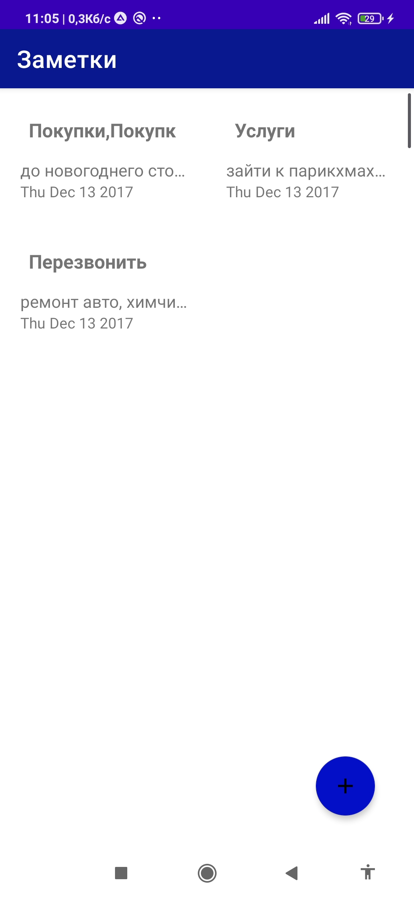
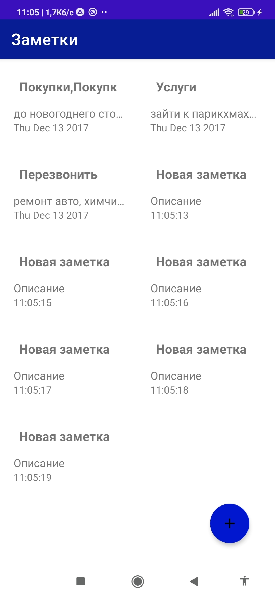

# android_task

Показывает список заметок.  
Реализация через RecyclerView  во фрагменте.  
Кнопка fab довавляет заметку со стандарнтым значением и текущем временем.  
TexView  если текст не помещаеться, то многоточие в конце.  

 

  
  

